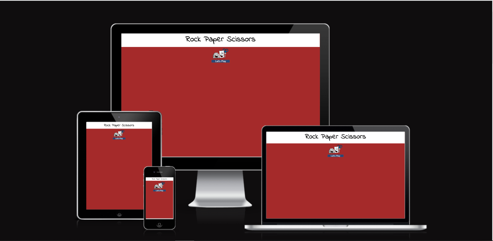

# Rock Paper Scissors
(Developer: Ewart Hestick)

[Live webpage](https://ewie1.github.io/CI_PP2_RPS/)

## Table of Content

1. [Project Goals](#project-goals)
    1. [User Goals](#user-goals)
    2. [Site Owner Goals](#site-owner-goals)
2. [User Experience](#user-experience)
    1. [Target Audience](#target-audience)
    2. [User Requrements and Expectations](#user-requrements-and-expectations)
    3. [User Stories](#user-stories)
3. [Design](#design)
    1. [Design Choices](#design-choices)
    2. [Colour](#colours)
    3. [Fonts](#fonts)
    4. [Structure](#structure)
    5. [Wireframes](#wireframes)
4. [Technologies Used](#technologies-used)
    1. [Languages](#languages)
    2. [Frameworks & Tools](#frameworks-&-tools)
5. [Features](#features)
6. [Testing](#validation)
    1. [HTML Validation](#HTML-validation)
    2. [CSS Validation](#CSS-validation)
    3. [Accessibility](#accessibility)
    4. [Performance](#performance)
    5. [Device testing](#performing-tests-on-various-devices)
    6. [Browser compatibility](#browser-compatability)
    7. [Testing user stories](#testing-user-stories)
8. [Bugs](#Bugs)
9. [Deployment](#deployment)
10. [Credits](#credits)
11. [Acknowledgements](#acknowledgements)

## Project Goals 
 

### User Goals

- Play a simple interactive game rock paper scissors
- 

### Site Owner Goals

- Build an easy to use interactive game 
- Build a game with an attractive design
- Build and game that is simple to navigate
-  

## User Experience

### Target Audience

- This game is build for the simple minded audience
- Audience who just want something simple to pass time 
- Younger Audience whi like cool images 

### User Reqirements and Expectaions

- Simple understanding
- Bright images
- Responsive features
- Play game on varius devices
-

### User Stories

#### First-time User 

 1. Start game by button click
 2. Have a colorful game area 
 3. Have attractive selection options
 4. Have attractive and fun response
 5. See a Score count
 6. See a final score
 7. Have a game over and restart game option

#### Returning User
 
 5. 
 6. 
 7. 
 8. 
 9. 

#### Site Owner 

10.
12. 
13. 
## Design

### Design Choices

### Colour

### Fonts

### Structure

- Into 
- Game page
- Game over and Restart page

### Wireframes

Into

 
 
 

Game

Game over and Restart page

404 page

## Technologies Used

### Languages

- HTML
- CSS

### Frameworks & Tools
- Git
- GitHub
- Gitpod
- Tinypng
- Balsamiq
- Google Fonts
- Font Awsome
- Favicon.io

## Features
The page consists of 3 pages and 9 sections

### Header Display
- The logo and nav bar section is one of the difference maker. It have a stylish logo which every
gym needs and also a navigation bar which allow the user to freely navigate between the three pages presented. Here you can also find a signup button which return user to get to the sigup page without the need to scroll. 

### Intro btn and Image
- Here the hero image that describe everything a user need in a gym laughter, diversity and work. Along with giving a feel for what you get at the gym there is also a cover note with two questios to catch the users interest and want to know more about the gym.
- User story covered: 1

 

### Game results
- The gym features list is consist of the many progarms available for training and the comforts the gym offer. With this information the user can consider compare to there regular gyms which will help them in deciding to click that signup button.
- User story covered: 4

### Score Count
- Easy nav is a simple buttton to have the user avoid scrolling up to get to the About Us page.
- This faeture serves the purpose of allow the user to go throught the page smoothly finding all the gym information with out the need of scrolling back up to the menu bar but use the more about us button to get to the second page whicg contains more information about the gym.

### Selected Images
- Open times are locate as we go down to give the user essentail information so they can  fit their schedule into the open times of the gym.

### Selection btns
- A simple image og the gym i like to call a teaser image of the interior of the gym so the user gets an idea of what to expect and what kind of enviroment the gym offers.
- User story covered: 3

### Restart Game
- The map which give the location for the gym with an easy click.
- User story covered: 2

## Validation

### HTML Validation

Game page

### CSS Validation

Style

### Accessibility

Home

About Us

Become a Member

### Performance 

Home

About Us

Become a Member

### Performing tests on various devices 

- HP EllitBook
- Amazon fire table 7
- Samsung galaxy 20

### Browser compatability

- Tested on Goole Chrome
- Tested Micrsoft Edge
- Tested on Morzilla Firefox

### Testing user stories

1. As  a first time user I expect a bright feel energetic gym feel

   | **Feature** | **Action** | **Expected Result** | **Actual Result** |
   |-------------|------------|---------------------|-------------------|
   | Color contrast | Bright color contrast and images with laughter |Website feels like the gym  | Works as expected |

   

Screenshots

   
   

2.  As a firstime user I want to know the location of the gym

    | **Feature** | **Action** | **Expected Result** | **Actual Result** |
    |-------------|------------|---------------------|-------------------|
    | Map | Scroll down on first page and click the google mag  | Goolge show gym location in the city | Works as expected |

     

Screenshots

     
     

3. As a first time user I want to see the gym interior
   | **Feature** | **Action** | **Expected Result** | **Actual Result** |
   |-------------|------------|---------------------|-------------------|
   | Gym interior image | Scroll down on home page | Find pictures of the gym interior | Works as expected |
    

Screenshots

    
    

4. As a first time user I want to know what training programs are available 

   | **Feature** | **Action** | **Expected Result** | **Actual Result** |
   |-------------|------------|---------------------|-------------------|
   | Trian with us and Gym comforts list | Scroll down on home page  | Readable intriguing list | Works as expected |
    

Screenshots

    
    

5. As a returning user I want to know where to sign up
   | **Feature** | **Action** | **Expected Result** | **Actual Result** |
   |-------------|------------|---------------------|-------------------|
   | Signup From | Cick signup button,Nav bar | Directed to signup page | Works as expected |

    

Screenshots

    
    

6. As a returning user i want contact information   
   | **Feature** | **Action** | **Expected Result** | **Actual Result** |
   |-------------|------------|---------------------|-------------------|
   | Footer  on all pages | On any page scroll to the footer | See phone number and email address | Works as expected |

     

Screenshots

     
     

7. As a returning user I was to know the reason and the mission of the gym

   | **Feature** | **Action** | **Expected Result** | **Actual Result** |   
   |-------------|------------|---------------------|-------------------|
   | About Us pragraph | Navigate to the us page in menu bar  | Read  | Works as expected |

     

Screenshots

     
     
     

8. As a returning user I want to know about the membership and options available

   | **Feature** | **Action** | **Expected Result** | **Actual Result** |
   |-------------|------------|---------------------|-------------------|
   | Membership Cards | Navigate to the About Uspage Scrooll down | Read | Works as expectd |

     

Screenshots

     
     
     

9. As a returning user, I want to see the gym's social media followings 

   | **Feature** | **Action** | **Expected Result** | **Actual Result** |
   |-------------|------------|---------------------|-------------------|
   | Footer - social media section | On any page scroll to the bottom | Click on social media links | Works as expected | 

     

Screenshots

     
     

10. As a siteowner I want the users to not only sign up but have membership option

    | **Feature** | **Action** | **Expected Result** | **Actual Result** |
    |-------------|------------|---------------------|-------------------|
    | Signup Form | U Navigate sign up page click dropdown option| Choose from drop down option | Works as expected |

    

Screenshots

    
    
    

11. As a owner I want user to have a cutomized 404 error page if the wedsite fail to load

    | **Feature** | **Action** | **Expected Result** | **Actual Result** |
    |-------------|------------|---------------------|-------------------|
    | 404 error page | On non-matched URL| Choose from drop down option | Works as expected |

    

Screenshots

    
    

12. As a site owner I want users to leave comments upon sign up

    | **Feature** | **Action** | **Expected Result** | **Actual Result** |
    |-------------|------------|---------------------|-------------------|
    | Signup form | Navigate to signup page | Leave comments | Works as expected |

     

Screenshots

     
     
     

    
## Bugs
  List of bugs found and fixes used ti mitigate them.

- Bug: the first page had overflow to the right of the page.
  Fix: with from the slack community i was refered to unicorn revealer which showed my opentimes width was too much. Adjusted this and issue was fixed
- Bug: during accessibilty test my good practice points were low
  Fix: using the unicorn revealer again imanaged to find my logo image had margin space and my about us text had border radius value that were unneccessary. Adjusted these issues and my score got better
- Bug: during html validation signup.html error, signup form "for" value and "id" value were not matching  
    Fix: Change both value to the same which rectified error
- Bug: html validation for index.hmtl warnings for lack of heading h1-h6 in section tags
  Fix: removed unneccesary section tags
- Bug: html validation error for all html file h1-h6 heading, some sequence wer skipped h2-h4 and    h2-h5 
   Fix: changed heading tag for all html file to the correct sequences
- Bug: Wave error for color contrast on navbar and more about us button "deep orange and very dark blue"
  Fix: change to a slightly brighter orange to mitigate issue,
- Bug: Wave error for color conflicting contrast with cover text for the hero image on the home page
  Fix: Add a lite background overlay wrapped in a div tag to mitigate issue
- Bug: loading performance on the home page was low due to hero image loading time
  Fix: replaced hero-image 
- Bug: background image for the "Become a Member" page look streched with distorted pixels
  Fix: Replaced "Become a Member" page backgroung image
- Bug: hero image overlay half way over the image  onthe big screen and overflowing into the ethos section
   Fix: adjusted padding bottom and confirmed issue was no longer present
   

## Deployment
The game was deployed using GitHub Pages by following these steps:
1. In the GitHub repository navigate to the Settings tab
2. On the left hand menu select Pages
3. For the source select Branch: master
4. After the webpage refreshes automaticaly you will se a ribbon on the top saying: "Your site is published at "https://ewie1.github.io/CI_PP2_RPS/"

You can for fork the repository by following these steps:
1. Go to the GitHub repository
2. Click on Fork button in upper right hand corner

You can clone the repository by following these steps:
1. Go to the GitHub repository 
2. Locate the Code button above the list of files and click it 
3. Select if you prefere to clone using HTTPS, SSH, or Github CLI and click the copy button to copy the URL to your clipboard
4. Open Git Bash
5. Change the current working directory to the one where you want the cloned directory
6. Type git clone and paste the URL from the clipboard ($ git clone https://github.com/YOUR-USERNAME/YOUR-REPOSITORY)  
7. Press Enter to create your local clone.

## Credits

### Media

Media images were referenced from <a href="https://www.pexels.com/">Pexels</a> , <a href="https://unsplash.com/">Upsplash</a> and <a href="http://www.freepik.com/">Freepik</a>. 

- [404-background](assets/images/404er.jpeg): <a href=" https://www.pexels.com/photo/an-apple-and-a-dumbbell-on-a-clipboard-8154260/" >Pexels</a>
  Photo by:  <a href="https://www.pexels.com/@alesiakozik/">Alesia Kozik</a>
- [signup-page-background](assets/images/signupimage.jpeg): <a href="https://www.pexels.com/photo/          personal-male-trainer-with-overweight-female-client-in-fitness-center-6455927/">Pexels</a>
  Photo by:  <a href="https://www.pexels.com/@julia-larson/">Julian Larson</a>
- [hero-image](assets/images/heroimage.jpg): <a href="https://www.freepik.com/premium-photo/sport-couple-doing-plank-exercise-workout-fitness-centrum-man-woman-practicing-plank-gym_17801349.htm">Freepik</a>
  Photo by: <a href= "https://www.freepik.com/author/weyo">Weyo</a>
- [crossfit-image](assets/images/crossfitsmall.jpg): <a href="https://unsplash.com/photos/h3D-RRvxfqE">Unsplash</a>
  Photo by: <a href="https://unsplash.com/@bastien_plu">Bastien Plu</a>
- [trainer-image](assets/images/trainer.jpeg): <a href="https://www.pexels.com/photo/ethnic-woman-exercising-with-battling-ropes-near-male-trainer-6455771/">Pexels</a>
  photo by: <a href= "https://www.pexels.com/@julia-larson/">Julian Larson</a>

### Code
 - My HTML code from lessons and formats from the html module and walk through project which then evolved into my owm structure as i gain more knowledge by trail and error.
 - My CSS code was also built on the concept of trail and error, google W3School wedsite tips.

## Acknowledgements
- Tanks and acknowlegement goes to my mentor Mo Shami great guidance.
- Acknowledge my brother Addan Mc Collin for support form a user's veiw
- Thanks to my girlfriend Hiba Salem for support and input on a user veiw
- Thankful to the Slack team for tips